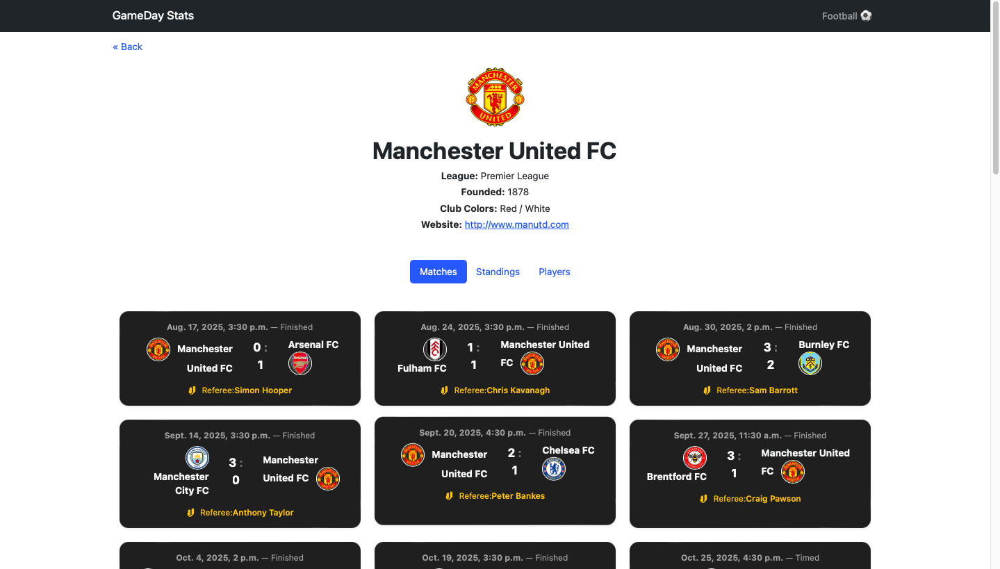

# 🏟️ Gameday Stats

**Gameday Stats** is a full-stack web application built with **Django** that provides live football (soccer) data — including fixtures, scores, standings, and player statistics — for the **top five European leagues**:  
**Premier League**, **La Liga**, **Serie A**, **Bundesliga**, and **Ligue 1**.

This project was developed as the **Final Project** for **CS50’s Web Programming with Python and JavaScript (CS50W)**.

---

##  Overview

Gameday Stats enables football fans to keep up with ongoing seasons through real-time data fetched
from multiple APIs. The project integrates **two data providers** — **API-Football** and **Football-Data.org** — and automatically updates results, fixtures, and player statistics via **GitHub Actions** (used instead of Celery due to hosting limitations on Render).

---

## Distinctiveness and Complexity
Gameday Stats is different from the other projects in this course because it focuses on real-time sports data and brings together several technologies to make that possible. Instead of simply storing user input like a to-do list or social network, this project connects to live football data APIs and updates its database automatically. It’s designed to feel like a real sports tracking platform, where users can see fixtures, scores, standings, and player stats across major European leagues — something far more dynamic than the earlier projects in the course.

One thing that makes this project more complex is the amount of data it handles and how that data is kept up to date. Rather than manually entering information, the app fetches data from two APIs, processes it, and stores it in a PostgreSQL database. It also uses GitHub Actions to automatically update the site on a schedule, so the information stays fresh without me having to run commands myself. This was challenging to set up, especially when figuring out how to make different services work together in a deployed environment.

Finally, this project shows a full understanding of what goes into creating and maintaining a complete web application — from backend logic and database design to front-end presentation and automation. It was built from scratch and not based on any previous assignment. Each part — the models, API integration, data updates, and interface — was written and connected by me. Overall, Gameday Stats combines everything I learned throughout the course into one cohesive and functional app, showing both distinctiveness and real-world complexity.

I decided to build Gameday Stats because I’m a big football fan and wanted a personal project that connects my interest in the sport with what I’ve learned in web development. This made it more engaging to build and helped me understand how professional sports platforms manage and update real-time data.

---

## 🗂 File Breakdown

- `models.py`: Data models for leagues, teams, players, matches 
- `views.py`: Handles data display and logic 
- `tasks.py`: GitHub Action-triggered data update helpers 
- `.github/workflows/update.yml`: Automated scheduled updates 
- `management/commands/`: Custom update commands 
- `settings.py`: Config, environment, and database setup 
- `templates/football/`: HTML templates 
- `static/football/`: CSS, JS, and images 
- `requirements.txt`: Lists all dependencies for deployment 

---

## 🚀 Features

- ⚽ **Fixtures & Live Scores** — view current and upcoming matches across the top 5 leagues  
- 📊 **League Standings** — real-time league tables  
- 👤 **Player & Team Stats** — goals, assists, appearances, and more  
- 🌍 **Multi-API Integration** — powered by **API-Football** and **Football-Data.org**  
- 🧠 **Smart Data Handling** — uses different APIs for different endpoints for maximum accuracy  
- 🌙 **Responsive UI** — designed with Bootstrap and custom CSS  

---

## 🧰 Technologies Used

| Category | Tools |
|-----------|--------|
| **Frontend** | HTML, CSS, Bootstrap, JavaScript |
| **Backend** | Django (Python) |
| **Database** | PostgreSQL |
| **APIs** | [API-Football](https://www.api-football.com/) and [Football-Data.org](https://www.football-data.org/) |
| **Version Control** | Git & GitHub |
| **Automation** | Github Actions |
| **Deployment** | Render |

---

## 🌐 Live Demo

You can explore the live version of **Gameday Stats** hosted on Render:

🔗 **[https://gameday-stats.onrender.com](https://gameday-stats.onrender.com)**

---

## ⚙️ Installation

Follow these steps to set up and run the project locally.

**Step 1 – Clone the Repository**
```bash
git clone https://github.com/sethnkwo8/Gameday-Stats.git
cd gameday-stats
```

---

**Step 2 – Create and Activate a Virtual Environment**
```bash
python -m venv venv
source venv/bin/activate      # macOS/Linux
venv\Scripts\activate         # Windows
```

---

**Step 3 – Install Dependencies**
```bash
pip install -r requirements.txt        
```

---

**Step 4 – Set Up Environment Variables**
Create a .env file in your project root and add:
```bash
SECRET_KEY=your_secret_key
DEBUG=True
API_FOOTBALL_KEY=your_api_football_key
FOOTBALL_DATA_KEY=your_football_data_key
DATABASE_URL=postgresql://<username>:<password>@<host>:<port>/<dbname>
```

---

**Step 5 – Run Migrations**
```bash
python manage.py makemigrations
python manage.py migrate
```

---

**Step 6 – Load Initial Data**
```bash
python manage.py loaddata data.json    
```

---

**Step 8 – Start the Development Server**
```bash
python manage.py runserver
```
Visit your app at:
http://127.0.0.1:8000/

---

## 🧠 How It Works

Gameday Stats integrates **two football APIs** and uses **Github Actions** to automatically update data on a schedule.

| Function | Data Source | Update Method |
|-----------|--------------|----------------|
| Fixtures & Live Scores | **API-Football** | Periodically updated |
| Player & Team Stats | **API-Football** | Fetched on demand or scheduled |
| League Standings | **Football-Data.org** | Updated daily |
| Historical Data | **Football-Data.org** | Optional background fetch |
  

---

## 🔁 Automated Data Updates (Github Actions)

Since Redis and Celery aren’t available on Render’s free plan, GitHub Actions are configured to automatically:

- Run scheduled manage.py commands
- Fetch latest fixtures, standings, and player stats
- Commit changes or trigger webhooks if needed

This ensures Gameday Stats remains up-to-date even after deployment.

## 🖼️ Project Screenshots

Below are key screenshots showcasing the main features of the Football Web App:

| Feature | Screenshot | Description |
|---------|------------|-------------|
| Home Page |  | The landing page with navigation and overview of leagues. |
| Fixtures |  | Displays upcoming and past matches for selected leagues and matchdays. |
| Standings |  | Shows league table with team positions, points, and stats. |
| Team Fixtures |  | Fixtures specific to a selected team. |
| Top Scorers |  | Lists the top goal scorers with goals, assists, and penalties. |
| Team Players |  | Shows squad details for a selected team, including coach and venue. |
| League Teams |  | Shows all the teams in a particular league | 

---
## 🎥 Video Demo

🎬 Watch the project walkthrough here:  
👉 [YouTube Link](https://youtu.be/bofClOn7viM) 

---

## 👨‍💻 Author

**Seth Nkwo**  
📧 [sethnkwocool@gmail.com]  
🔗 [GitHub Profile](https://github.com/sethnkwo8)  
🔗 [LinkedIn Profile](https://www.linkedin.com/in/seth-nkwo/)  

---

## 🏁 Acknowledgements

Special thanks to:
- The **CS50 Team** for an incredible course and guidance  
- **API-Football** and **Football-Data.org** for providing reliable football data APIs  
- **Github Actions** for automation and continuous deployment support 
- **Render** for hosting

---


